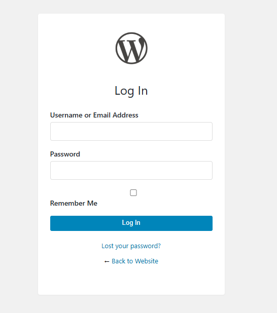
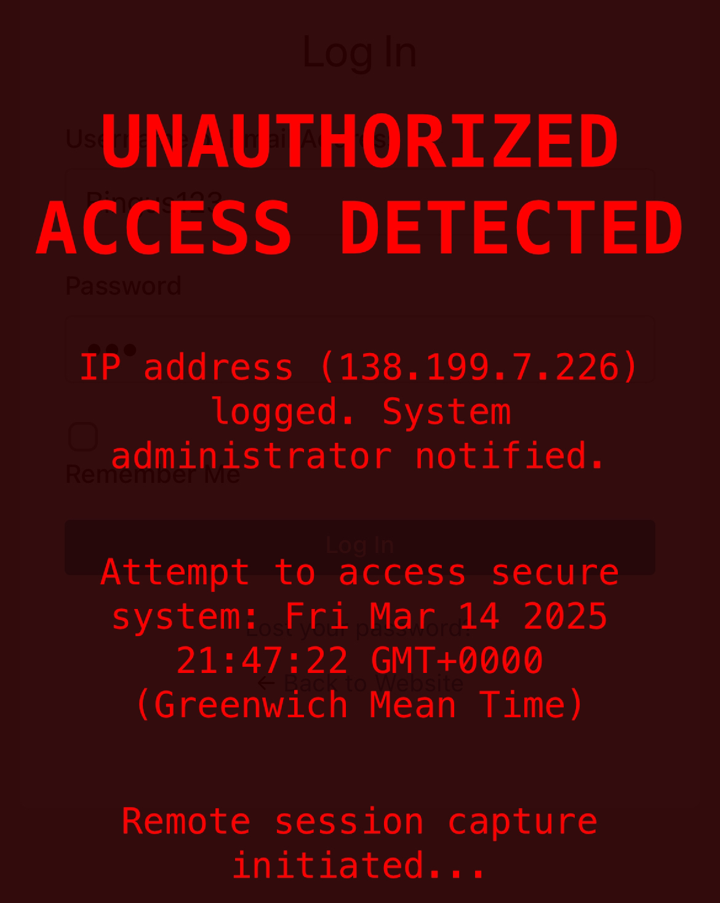
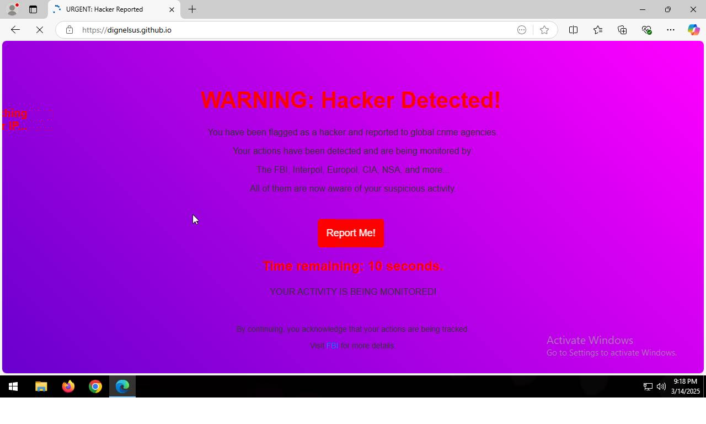

# WordPress Security Honeypot System 🔒🚨

**A sophisticated deception system to protect WordPress admin portals by capturing intrusion attempts and redirecting attackers to a custom scare page.**



## Features ✨

### 🕵️‍♂️ Fake WordPress Login Page
- Perfect replica of default WordPress login
- Responsive design matching original behavior
- Hidden tracking scripts
- Browser fingerprint collection
- Automatic credential capture

### ⚠️ Intrusion Response System
- Real-time Discord webhook notifications
- Attacker information logging:
  - IP address
  - Geolocation
  - Browser fingerprint
  - Screen resolution
  - Timestamp
- Fullscreen lock mechanism
- Redirection to custom scare page
- Psychological deterrent messages

### 🚨 Scare Page Features
- Persistent fullscreen mode
- IP address display
- Fake system logging animations
- Authority notification simulation
- Location tracking warnings
- 8-second countdown redirect
- Hidden escape mechanism






## Installation 💻

1. Clone repository:
```bash
git clone https://github.com/dignelsus/dignelsus.github.io

```bash
The unconfigured fake WP login file is listed.
